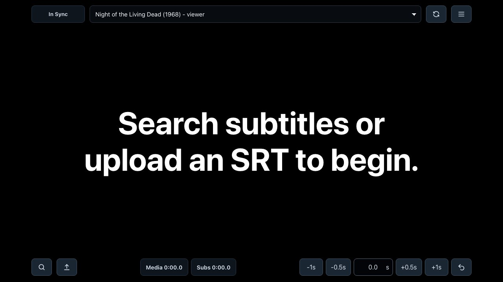
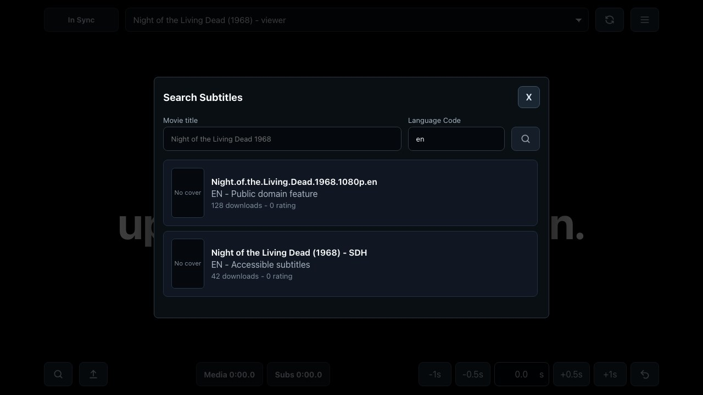
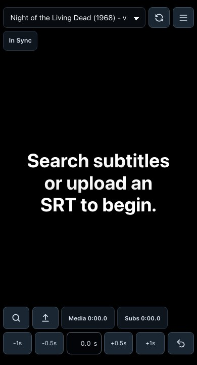

# sidesubs

Jellyfin sidecar subtitle app for showing synced subtitles on a second screen.

This is an MVP for personal homelab use: open the app on an iPad or another browser, load subtitles, select the Jellyfin session currently playing, and let the browser render subtitles in sync with playback.

## Features

- Display subtitles on a second screen while watching Jellyfin.
- Upload local `.srt` files.
- Search and download subtitles from OpenSubtitles.
- Select an active Jellyfin playback session.
- Keep subtitle timing synced across pause, resume, seek, stop, and session changes.
- Adjust subtitle timing offset from the UI.
- Render subtitles locally in the browser.
- Run as a single Docker container.

## Screenshots

Desktop subtitle view:



OpenSubtitles search modal:



Mobile subtitle view:



## Quick Start

Copy `.env.example` to `.env` and set the required Jellyfin values:

```sh
JELLYFIN_BASE_URL=http://your-jellyfin-host:8096
JELLYFIN_ACCESS_TOKEN=your-token
```

Start the app:

```sh
docker compose up --build
```

Open the web app:

```text
http://localhost:3000
```

The container logs high-level playback/session activity and serves the frontend from the backend.

## Configuration

Required Jellyfin variables:

```sh
JELLYFIN_BASE_URL=http://your-jellyfin-host:8096
JELLYFIN_ACCESS_TOKEN=your-token
```

`JELLYFIN_ACCESS_TOKEN` can be a Jellyfin user access token or API key. User access tokens may expose richer session data for some WebSocket messages.

Optional Jellyfin/server variables:

```sh
JELLYFIN_DEVICE_ID=sidesubs-docker
JELLYFIN_DEVICE_NAME=sidesubs
JELLYFIN_CLIENT_NAME=sidesubs
JELLYFIN_CLIENT_VERSION=0.1.0
JELLYFIN_SESSION_POLL_INTERVAL_MS=5000
JELLYFIN_SUBSCRIPTION_INTERVAL_MS=1000
LOG_LEVEL=info
PORT=3000
```

OpenSubtitles variables:

```sh
OPENSUBTITLES_API_KEY=your-opensubtitles-api-key
OPENSUBTITLES_ACCESS_TOKEN=optional-bearer-token
OPENSUBTITLES_USERNAME=optional-opensubtitles-username
OPENSUBTITLES_PASSWORD=optional-opensubtitles-password
OPENSUBTITLES_BASE_URL=https://api.opensubtitles.com/api/v1
OPENSUBTITLES_USER_AGENT=sidesubs v0.1.0
```

`OPENSUBTITLES_API_KEY` is required only for the Search Subtitles modal. If it is missing, the app still starts and manual SRT upload still works.

For downloads that require login, set either `OPENSUBTITLES_ACCESS_TOKEN` or `OPENSUBTITLES_USERNAME` and `OPENSUBTITLES_PASSWORD`; login happens in memory on the backend.

Set `LOG_LEVEL=debug` only when you want extra websocket keepalive/subscription details.

## Using The App

1. Open `http://localhost:3000` on the second-screen device.
2. Start playback in Jellyfin.
3. Select the active Jellyfin session from the top dropdown.
4. Upload an SRT file or use Search Subtitles.
5. Adjust timing offset if the subtitles are early or late.
6. Use the settings menu for subtitle size, position, and theme.

The frontend can load `.srt` subtitle files from the file picker, search OpenSubtitles, select an active Jellyfin playback session, and render subtitles against that session's playback position.

Search results show OpenSubtitles poster images when available. The browser loads those through the backend cover proxy, so the frontend still does not talk directly to OpenSubtitles.

## Subtitle Languages

The subtitle search language dropdown is configured in `subtitleLanguages.json` at the repository root.
Each entry needs an OpenSubtitles language `code` and a display `name`:

```json
[
  {
    "code": "en",
    "name": "English"
  }
]
```

Add an entry there if OpenSubtitles supports a language that is missing from the UI. Remove an entry to hide it from the dropdown.

The language field in the search modal is still editable, so users can type a valid OpenSubtitles language code manually even if it is not listed in the dropdown.

When using the included Docker Compose file, this JSON file is mounted into the container and read by the backend at runtime. After editing the file, refresh the browser page to reload the dropdown.

If you run the image without that bind mount, the app uses the copy baked into the Docker image.

## Published Image

Docker images are published to GitHub Container Registry:

```sh
docker pull ghcr.io/pewdex/sidesubs:latest
```

Published images support `linux/amd64` and `linux/arm64`, so the same `latest` tag should work on typical Intel/AMD servers and Apple Silicon Macs.

Run the published image directly:

```sh
docker run --rm \
  --env-file .env \
  -p 3000:3000 \
  ghcr.io/pewdex/sidesubs:latest
```

Example `docker-compose.yml` using the published image:

```yaml
services:
  sidesubs:
    image: ghcr.io/pewdex/sidesubs:latest
    env_file:
      - .env
    ports:
      - "3000:3000"
    volumes:
      - ./subtitleLanguages.json:/app/config/subtitleLanguages.json:ro
    restart: unless-stopped
```

## Local Development

Install all workspace dependencies from the repo root:

```sh
npm install
```

Run the Jellyfin WebSocket/static server:

```sh
npm run dev:server
```

Run the React + Vite frontend during UI development:

```sh
npm run dev:web
```

Build both apps:

```sh
npm run build
```

## Technical Overview

The backend talks to Jellyfin, tracks active playback sessions in memory, and streams playback snapshots to browser clients with Server-Sent Events.

The frontend renders uploaded or OpenSubtitles-downloaded SRT subtitles locally in the browser using the selected Jellyfin session's playback position. Subtitle rendering happens in the browser; subtitle text is not streamed by the server during playback.

The frontend does not communicate directly with Jellyfin or OpenSubtitles. Jellyfin session discovery, OpenSubtitles search/download, and cover proxying all go through the backend.

Playback state is kept in memory. There is no database, Redis, or background job system.

## API Reference

Active Jellyfin playback sessions:

```sh
GET /api/playback-sessions
```

Live playback updates for browser clients:

```sh
GET /api/playback-events
```

Subtitle language dropdown config:

```sh
GET /api/subtitle-languages
```

Subtitle search endpoints:

```sh
GET /api/subtitles/search?query=Movie%20Title&language=en
POST /api/subtitles/download
GET /api/subtitles/cover?url=https%3A%2F%2F...
```

`/api/playing-movies` is still available as a compatibility endpoint.

## Project Layout

```text
apps/
  server/  Express API, Jellyfin websocket/session tracking, SSE, static frontend
  web/     React + Vite SRT subtitle display
```

The two apps are maintained as npm workspaces. Docker builds both and runs one container where the backend serves the built frontend.

## Release Flow

GitHub Actions builds the root `Dockerfile` and publishes to GHCR on every push to `main`.
The `main` image is tagged as:

```text
ghcr.io/pewdex/sidesubs:latest
```

When a Git tag or GitHub release is created, the workflow also publishes versioned tags from the tag name. For example, `v1.2.3` publishes `1.2.3`, `1.2`, `1`, and the tag reference.

The workflow uses the built-in `GITHUB_TOKEN` with `packages: write` permission, so no personal access token is required.
